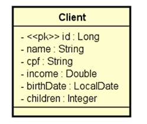

# Desafio avaliativo do curso de formação Spring Boot Profissional da DevSuperior ministrado pelo professor Nélio Alves.

## Capitulo: Criação de API REST, Camadas, CRUD, Excessões e Validações.

## ESPECIFICAÇÃO - Sistema EVENTO

O projeto deverá ser entregue em um projeto Java com Spring contendo um CRUD completo de web services REST para acessar um recurso de clientes contendo as cinco operações básicas aprendidas no capítulo:
    
* Busca paginada de recursos
* Busca de recurso por id
* Inserir novo recurso
* Atualizar recurso
* Deletar recurso

O projeto deverá estar com um ambiente de testes configurando o banco H2, deverá usar o Maven como gerenciador de dependências, Java como linguagem de programação e o framework Spring

Um cliente possui nome, CPF, renda, data de nascimento e quantidade de filhos. A especificação da entidade Clinet é mostradas na URL abaixo.

# UML do desafio

## Informações gerais:

Seu projeto deverá incluir um seed de pelo menos dez clientes e deverá tratar as seguintes exceções:

* Id não encontrado
* Erro de validação
  * Nome não pode ser vazio
  * Data de nascimento não pode ser o dia de hoje ou alguma data no futuro

# Como o trabalho será corrigido?

* Importação do projeto:
        O professor deverá ser capaz de fazer um simples 
        clone do projeto no GitHub, importar e executar o
        mesmo na IDE, sem a necessidade de qualquer
        tipo de configuração.

* Testes manuais no Postman
        O professor já terá preparado em seu computador as
        requisições Postman abaixo, todas deverão funcionar
        perfeitamente

## Checklist: 

* Busca por id retorna cliente existente
* Busca por id retorna 404 para cliente inexistente
* Busca paginada retorna listagem corretamente
* Inserção de cliente insere o cliente com os dados válidos
* Inserção de clientes retorna 422 e mensagens customizadas com dados inválidos
* Atualização de clientes com os dados válidos
* Atualização de clientes retorna 404 para cliente inexistente
* Atualização de clientes retorna 422 e mensagens customizadas para dados inválidos
* Deleção de cliente deleta cliente existente
* Deleção de cliente retorna 404 para cliente inexistente. 

## Desenvolvedor:

 

## Juliano Martins de Souza

### Contatos

  
  
  
  
